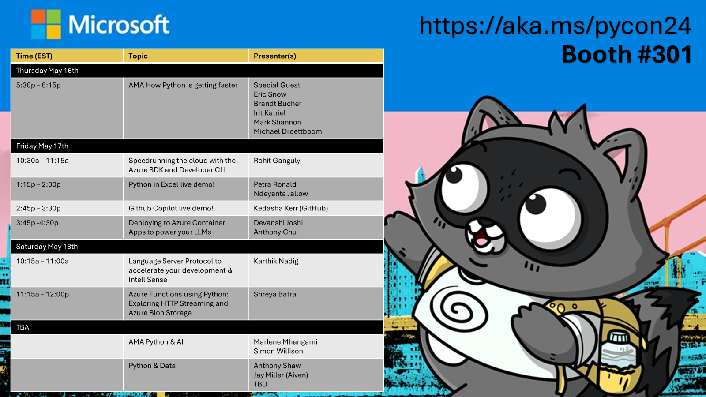
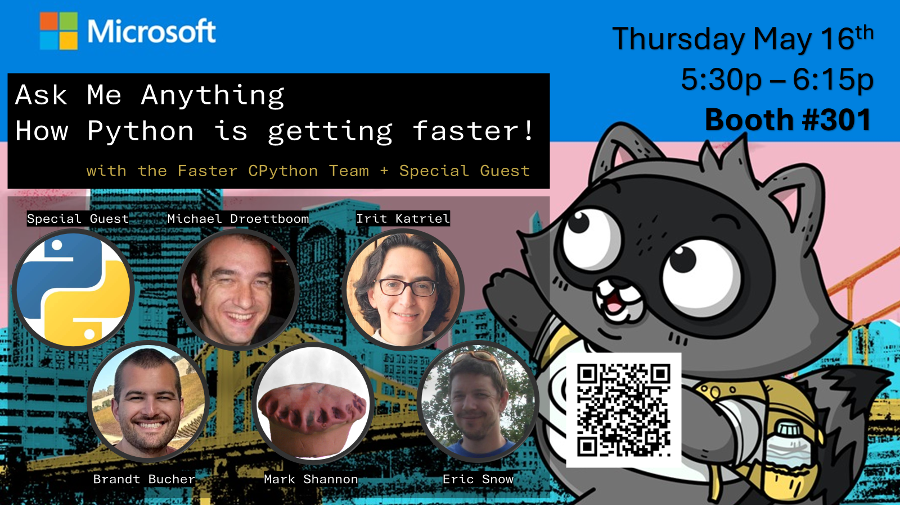
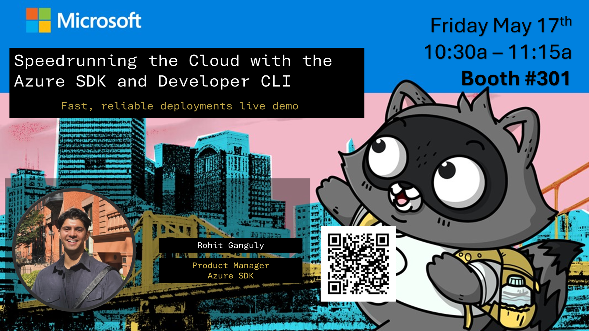
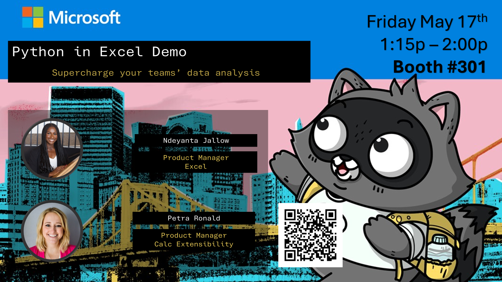
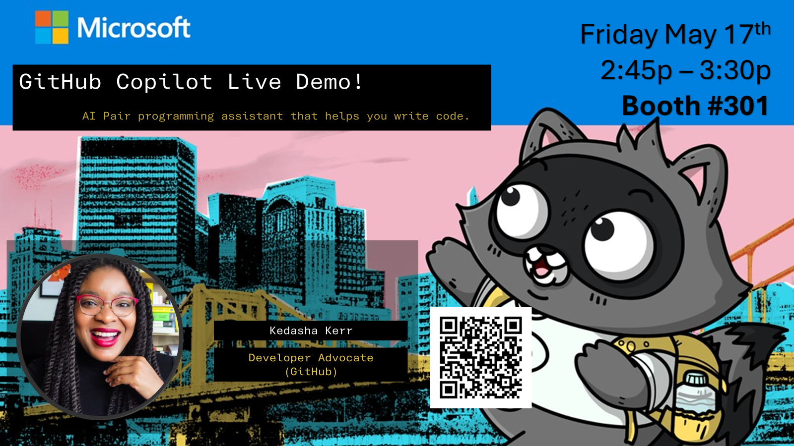
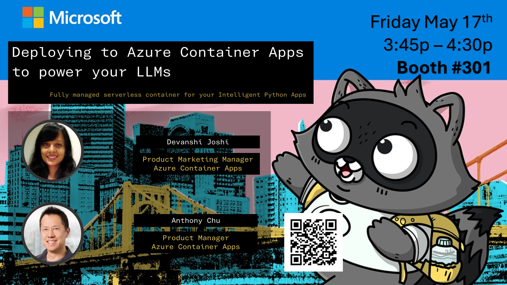
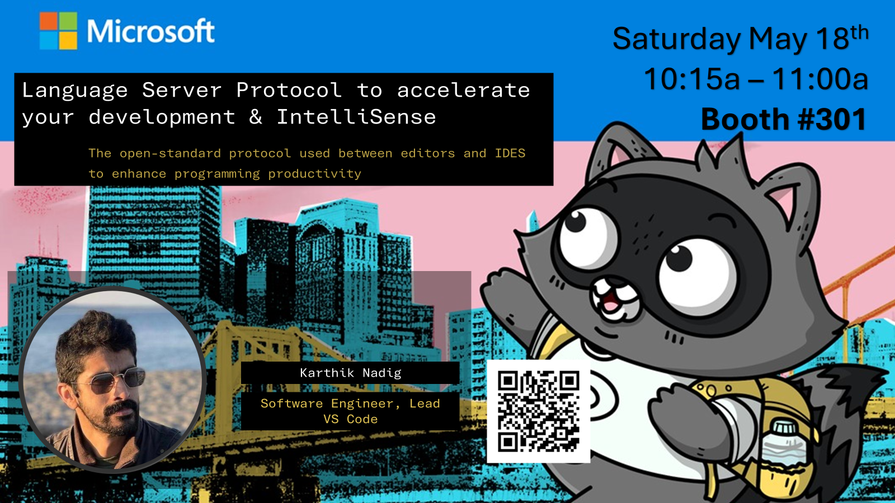
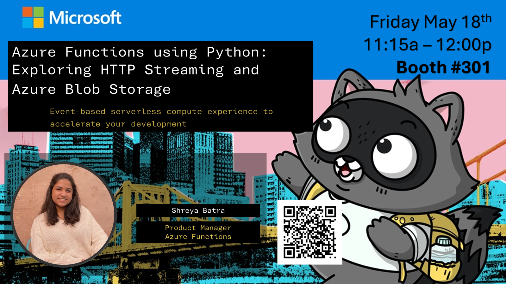

# Welcome to PyCon 2024

---

- [🥤 Deploy Simple Flask Server Example, **get a water bottle** ](#🥤-Deploy-Simple-Flask-Server-Example-get-a-water-bottle)
- [🖼️ Scan a badge or give some feedback, **get some stickers**](#🖼️-Scan-a-badge-or-give-some-feedback-get-some-stickers)
- [👒 Take a survey, **get a beanie**](#👒-Take-a-survey-get-a-beanie)
- [🎩 Sign up for Azure Open AI, **get a snap back**](🎩-Sign-up-for-Azure-Open-AI-get-a-snap-back)
- [📅 PyCon Talks by our Microsoft Team!](#PyCon-Talks)
- [📆 Booth schedule and 'add to calendar'](#Presentations-at-the-Microsoft-Booth-301)W
- [😁 The Team at PyCon](#the-team-at-pycon)
- [What's New in Microsoft and Python](#Whats-New-in-Microsoft-and-Python)
    - [Azure development workflows just made your life easier](#Azure-development-workflows-just-made-your-life-easier)
    - [Superpower your Python development experience](#Superpower-your-Python-development-experience)
    - [Unlock Excel's Superpowers](#Unlock-Excels-Superpowers)
- [💬 Hang out with us virtually](#hang-out-with-us-virtually)
- [Code of Conduct](#code-of-conduct)
- [Trademarks](#trademarks)

Learn more about all the things Microsoft is working on in the Python community!

# Want Swag?
<small>*while supplies last*</small>

## Deploy Simple Flask Server Example, **get a water bottle** 🥤(+15 minutes)

Python on Azure is faster than ever! That includes everything from deploying it to its performance! To prove it, we challenge you to deploy a flask app to Azure App Service!

See how fast you can deploy a webapp to azure. Show us your deployed application and you'll get a $50 Gift Card to [The GitHub Shop](https://www.thegithubshop.com/)!

[Learn how to participate](azure-speedrun.md)

## 🖼️ Scan a badge or give some feedback, **get some stickers**  (+30 seconds)

We're so glad we talked to you! Your information will not be used for any marketing purposes unless expecitly opted in. Check out the [Microsoft privacy statement](https://privacy.microsoft.com/en-US/privacystatement).

## 👒 Take a survey, **get a beanie** (+6 minutes)
Take [the survey](https://aka.ms/Pycon24Survey) at the booth and recieve a beanie.

🤔 What type of questions are we asking? 

> If you have one wish for the teams at Microsoft focusing on Python, what would that be?
---
> How are **YOU** using Python?

<small>Activity must be initiated at the booth and completede before leaving booth #301.</small>

## 🎩 Sign up for Azure Open AI, **get a snap back** (+5 minutes)
- Step one: Create an Azure account if you do not already have one. To create your account and check out all of the free services available to you see  [https://azure.microsoft.com/free/](https://azure.microsoft.com/free/). 

- Step two: Visit Azure Open AI application page: [https://aka.ms/oaiapply](https://aka.ms/oaiapply) and follow the instructions provided to complete the registration process.

<small>Activity must be initiated at the booth and completede before leaving booth #301.</small>

## 🎮 Sign up for raffle, **you could win an Xbox!** (+30 seconds)
C'mon! Try to win a game console, on us.

## PyCon 2023 Presentation Schedule

### PyCon Talks

Catch some of the talks from our team members presenting at PyCon!

|Time (EST)|Topic|Speaker(s)|Location|
|----|----|----|---|
|Friday 17 May||||
|11:45a – 12:15p|[What makes a Python debugger possible and how can we make it 100x faster](https://us.pycon.org/2024/schedule/presentation/6/)|Tian Gao|301-305<ul><li>https://aka.ms/pycon24/add-to-cal/faster-cpython</li></ul>|
|Saturday 18 May||||
|12:00p – 12:45p|[Measuring the performance of CPython](https://us.pycon.org/2024/schedule/presentation/10/)|Michael Droettboom|Ballroom BC <ul><li>https://aka.ms/pycon24/add-to-cal/faster-cpython</li></ul>|
|2:30p – 3:00p|[Eternal sunshine of the spotless development environment](https://us.pycon.org/2024/schedule/presentation/123/)|Sarah Kaiser|301-305 <ul><li>https://aka.ms/pycon24/add-to-cal/faster-cpython</li></ul>|
|3:15p-3:45p|[CPython's Compilation Pipeline](https://us.pycon.org/2024/schedule/presentation/3/)|Irit Katriel|301-305 <ul><li>https://aka.ms/pycon24/add-to-cal/faster-cpython</li></ul>|
|1:00p – 1:30p|[Rest Easy with Jupyrest: Deploy notebooks as web services](https://us.pycon.org/2024/schedule/presentation/95/)|Koushik Krishnan|Ballroom BC <ul><li>https://aka.ms/pycon24/add-to-cal/faster-cpython</li></ul>|
|1:00p – 1:30p|[Rest Easy with Jupyrest: Deploy notebooks as web services](https://us.pycon.org/2024/schedule/presentation/95/)|Koushik Krishnan|Ballroom BC <ul><li>https://aka.ms/pycon24/add-to-cal/faster-cpython</li></ul>|
|1:00p – 1:30p|[Building a JIT compiler for CPython](https://us.pycon.org/2024/schedule/presentation/124/)|Brandt Bucher|Ballroom A <ul><li>https://aka.ms/pycon24/add-to-cal/faster-cpython</li></ul>|
|2:30p – 3:00p|[Unlocking the Parallel Universe: Subinterpreters and Free-Threading in Python 3.13](https://us.pycon.org/2024/schedule/presentation/124/)|Anthony Shaw|Ballroom A <ul><li>https://aka.ms/pycon24/add-to-cal/faster-cpython</li></ul>|

### Presentations at the Microsoft Booth #301

If you're in the Expo Hall check out some of our special presentations and **enter to win a XBox**!

||Time (EST)|Topic|Speaker(s)|Description|Links|
|---|----|----|----|---|---|
|Thursday 16 May|||||
||5:30p – 6:15p|AMA How Python is getting faster|<ul><li>Special Guest</li><li>Eric Snow</li><li>Brandt Bucher</li><li>Irit Katriel</li><li>Mark Shannon</li><li>Michael Droettboom</li></ul>||<ul><li>https://aka.ms/pycon24/add-to-cal/faster-cpython</li></ul>|
|Friday 17 May|||||
||10:30a – 11:15a|Speedrunning the cloud with the Azure SDK and Developer CLI|Rohit Ganguly||<ul><li>https://aka.ms/pycon24/add-to-cal/azure-sdk</li></ul>|
||1:15p – 2:00p|Python in Excel live demo!|<ul><li>Petra Ronald</li><li>Ndeyanta Jallow</li></ul>||<ul><li>https://aka.ms/pycon24/add-to-cal/python-excel</li></ul>|
||2:45p – 3:30p|Github Copilot live demo!|Kedasha Kerr (GitHub)||<ul><li>https://aka.ms/pycon24/add-to-cal/github-copilot</li></ul>|
||3:45p -4:30p|Deploying to Azure Container Apps to power your LLMs|<ul><li>Devanshi Joshi</li><li>Anthony Chu</li></ul>||<ul><li>https://aka.ms/pycon24/add-to-cal/aca-llm</li></ul>|
|Saturday 18th May|||||
||10:15a – 11:00a|Language Server Protocol to accelerate your development & IntelliSense|Karthik Nadig||<ul><li>https://aka.ms/pycon24/add-to-cal/lsp-vsc</li></ul>|
||11:15a – 12:00p|Azure Functions using Python: Exploring HTTP Streaming and Azure Blob Storage|Shreya Batra||<ul><li>https://aka.ms/pycon24/add-to-cal/azure-functions</li></ul>|

# What's New in Microsoft and Python

### Azure development workflows just made your life easier

🤖 Develop Python apps that harness the power of Azure AI services: https://aka.ms/azai/

&nbsp;&nbsp;&nbsp;&nbsp;&nbsp;&nbsp;&nbsp;🔃 Learn how to switch between OpenAI and Azure OpenAI endpoints with the Python SDK: https://learn.microsoft.com/en-us/azure/ai-services/openai/how-to/switching-endpoints

&nbsp;&nbsp;&nbsp;&nbsp;&nbsp;&nbsp;&nbsp;💪 Try it out with these samples: [Azure OpenAI Chat Completions](https://github.com/pamelafox/python-openai-demos) and [Azure OpenAI Assistants](https://github.com/kristapratico/aoai_assistants_demo)!

🏃‍♀️ Speed up your deployment process with the [Azure Developer CLI (azd)](https://docs.microsoft.com/en-us/cli/azure/install-azure-cli) and [`azd` templates](https://azure.github.io/awesome-azd/) 

&nbsp;&nbsp;&nbsp;&nbsp;&nbsp;&nbsp;&nbsp;💪 Try it out with this [Azure OpenAI and AI Search sample](https://github.com/Azure-Samples/azure-search-openai-demo)!

⚡ Get the best out of serverless development with [Azure Functions](https://learn.microsoft.com/en-us/azure/azure-functions/functions-bindings-triggers-python) -- now offering a more Pythonic experience with their v2 model for more alignment with the language

&nbsp;&nbsp;&nbsp;&nbsp;&nbsp;&nbsp;&nbsp;💪 Try it out with this [Quickstart Tutorial](https://learn.microsoft.com/en-us/azure/azure-functions/create-first-function-vs-code-python?pivots=python-mode-decorators)!

📢 Python 3.12 is now available on Azure! Check the [Azure Documentation for Python Developers](https://azure.microsoft.com/en-us/resources/developers/python/)

💵 Consult pricing in the [Azure Cost Portal](https://azure.microsoft.com/pricing/calculator/)

➡️ Don't have an Azure account? Sign up for free at https://azure.microsoft.com/en-us/free/

### Superpower your Python development experience 

#### Reproducible dev environments in Visual Studio Code

📂 Get your code to work on any machine with [dev containers](https://code.visualstudio.com/docs/devcontainers/containers)

 &nbsp;&nbsp;&nbsp;&nbsp;&nbsp;&nbsp;&nbsp;💪 Try it out with our [TheCatSaidNo](https://github.com/luabud/TheCatSaidNo) Flask sample!

☁️ Take your dev environments to the cloud with [GitHub Codespaces](https://code.visualstudio.com/docs/remote/codespaces)

&nbsp;&nbsp;&nbsp;&nbsp;&nbsp;&nbsp;&nbsp;📺 Check out Dawn Wages's and Pamela Fox's conversation on the [Python Pulse](https://devblogs.microsoft.com/python/announcing-python-pulse/): ["Using PostgreSQL inside VS Code Dev Containers & GitHub Codespaces"](https://www.youtube.com/watch?v=JTHTWp9DIZQ)

#### Boost your productivity when developing Python in Visual Studio Code  
🧠 Get the best from AI to empower your development experience with [GitHub Copilot](https://code.visualstudio.com/docs/editor/artificial-intelligence)

✨ Check out the [latest features of the Python and Jupyter extensions for VS Code](https://devblogs.microsoft.com/python/)

📊 Revolutionize your data processing workflow with the [Data Wrangler for VS Code](https://aka.ms/datawrangler)  

&nbsp;&nbsp;&nbsp;&nbsp;&nbsp;&nbsp;&nbsp;💪 Try it out with our [titanic](https://github.com/luabud/pycascades2023-msft/tree/main/titanic) sample!

🖌️ Create your own [Python tools extension for VS Code with our template](https://github.com/microsoft/vscode-python-tools-extension-template)

⚙️ Customize your VS Code experience like never before with [Profiles](https://code.visualstudio.com/docs/editor/profiles), designed to simplify your workflow and boost productivity

🌐 Code anywhere, anytime with [vscode.dev](https://vscode.dev/) and [github.dev](https://github.dev/)  

&nbsp;&nbsp;&nbsp;&nbsp;&nbsp;&nbsp;&nbsp;💪 Try it out with our [wordle](https://github.com/luabud/wordle) sample!

#### Unlock Excel's Superpowers
📊  Supercharge your data analysis and tell better stories with [Python in Excel](https://www.microsoft.com/en-ca/microsoft-365/python-in-excel)

### Discover how Microsoft is actively contributing to the growth and development of Python

🐍 Learn how a team at Microsoft is [helping make Python faster](https://github.com/faster-cpython/ideas/blob/main/3.13/README.md)

🌌 Contribute to the development of [Quantum computing with GitHub Codespaces](https://www.youtube.com/watch?v=nj1ltuk7js8)

## Stay in touch!

🐦 Join us on [Twitter](https://twitter.com/pythonvscode)

💬 Join us on [Discord](https://aka.ms/python-discord)

🐍 Catch us on the [Python Pulse](https://devblogs.microsoft.com/python/announcing-python-pulse/), streamed every month

## The Team at PyCon

Visit us at the Microsoft Booth (booth #301) or out in the Hallway Track!

### Microsoft booth team

|Conference Booth Team|||
|---|---|---|
|**Anthony Chu​**   ACA​| **Anthony Shaw**   Azure |**Brandt Bucher​** (Speaker)   CPython |
|**Courtney Webster**   Python VS Code|**Dawn Wages​**   Python Community|**Devanshi Joshi**​   Azure Container Apps|
|**Dmitry Osipov**​   Software Engineer | **Guido Van Rossum​**   Distinguished Engineer |**Irit Katriel** (Speaker)   CPython|
|**Johan Stenberg**​   Azure Python SDK Engineer|**Karthik Nadig**   Python VS Code Engineer​|**Krista Pratico**   Azure Python SDK|
|**Luciana Abud**   Python VS Code​|**Mark Shannon**​   CPython|**Michael Droettboom**​ (Speaker)   CPython|**Ndeyanta Jallow**   Python in Excel|
|**Paul Van Eck**   Azure Python SDK Engineer ​|**Rohit Ganguly**   Azure Python SDK ​|**Sarah Kaiser​** (speaker)   ML / Data Science|
|**Shreya Batra**​   Azure Functions|**Eric Snow**   CPython​|**Koushik Krishnan**(Speaker)   Site Reliability Engineer|
|**Tian Gao** (Speaker)  Software Engineer |||

|PyCon Virtual Team|
|---|
|**Anthony Kim**   Python VS Code​|
|**Eleanor Boyd**​   Python VS Code|
|**Marlene Mhangami**   Azure​|
|**Pamela Fox**   Azure​|

## Hang out with us virtually

### Join the Microsoft Python Discord

Join our [Microsoft Python Discord](https://aka.ms/python-discord) and connect with other Python developers in the Microsoft Community.

Come say hi to our virtual team members,share your photos with us and make plans to connect with one another in our [#pycon](https://discord.com/channels/702724176489873509/1096501197965361282) channel. 

### Check out the Python Pulse

Tune into our monthly [Python Pulse](https://youtube.com/playlist?list=PLj6YeMhvp2S4aIxuGH0NaGXQZlVUBsH3E) Series to get updated on the latest Python news and announcements around Microsoft!

## Stay Connected with Microsoft - Microsoft .Source Newsletter
Sign up for the [Microsoft.Source Newsletter](https://azure.microsoft.com/en-us/resources/join-the-azure-developer-community/)

Get the latest articles, documentation, and events from Microsoft.Source—the curated monthly developer community newsletter. Learn about new technologies and find opportunities to connect with other developers online and locally.

- Stay at the forefront of rapidly evolving technologies with resources that are relevant to your field, location, and areas of interest—including articles, GitHub repositories, and how-to guides.
- Get notified about events—from local hacks, workshops, and training sessions to virtual meetups and global conferences.
- Learn what you want, when you want, how you want. Resources include in-person hands-on workshops, free, interactive online training and sandbox environments.

## Code of Conduct

While at PyCon US, we expect all Booth attendees and staff to follow the [PyCon US Code of Conduct](https://us.pycon.org/2023/about/code-of-conduct/) as well as the [Microsoft Events Code of Conduct](https://aka.ms/codeofconduct).

If you have any questions or concerns while at the Microsoft Booth, feel free to do any of the following:

- Find and speak to a member of the Microsoft Booth Code of Conduct Team (Eryn Clark & Jay Miller)
- Reach out to the PyCon US Code of Conduct Team (email: pycon-us-report@python.org)
- Email our Events Code of Conduct buscond@microsoft.com

## Trademarks

This project may contain trademarks or logos for projects, products, or services. Authorized use of Microsoft
trademarks or logos is subject to and must follow
[Microsoft's Trademark & Brand Guidelines](https://www.microsoft.com/en-us/legal/intellectualproperty/trademarks/usage/general).
Use of Microsoft trademarks or logos in modified versions of this project must not cause confusion or imply Microsoft sponsorship.
Any use of third-party trademarks or logos are subject to those third-party's policies.

----------
_Written with the help of artificial intelligence 🤖_

---
