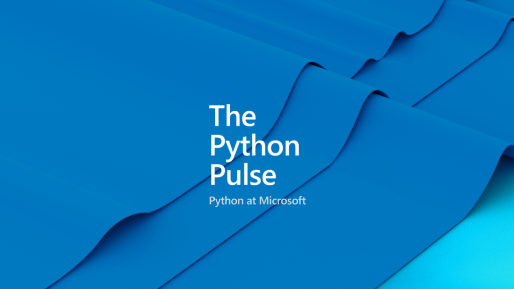

# Welcome to PyCon 2023

Table of Contents
----
- [Welcome to PyCon 2023](#welcome-to-pycon-2023)
  - [Table of Contents](#table-of-contents)
  - [Take the Azure Django Deployment Speedrun :car: 💨](#take-the-azure-django-deployment-speedrun-car-)
  - [Python 3.11 now available on Azure](#python-311-now-available-on-azure)
    - [Check out our Ask the Expert Sessions:](#check-out-our-ask-the-expert-sessions)
  - [Deploying to Azure is Easier Than Ever with AZD](#deploying-to-azure-is-easier-than-ever-with-azd)
  - [VS Code and Python](#vs-code-and-python)
  - [Microsoft is Helping Make Python Faster](#microsoft-is-helping-make-python-faster)
  - [Our PyCon Presentation Schedule](#our-pycon-presentation-schedule)
    - [PyCon Talks](#pycon-talks)
    - [Presentations at the Microsoft Booth](#presentations-at-the-microsoft-booth)
    - [Talk Python To Me Special](#talk-python-to-me-special)
    - [Deploying a Django Application to Azure Using VS Code](#deploying-a-django-application-to-azure-using-vs-code)
    - [Supercharge your VS Code Session](#supercharge-your-vs-code-session)
    - [Python Testing with Playwright](#python-testing-with-playwright)
    - [Setting up AZD for our Django Application](#setting-up-azd-for-our-django-application)
    - [Ask Brett (a)Bout Anything (ABBA)](#ask-brett-about-anything-abba)
  - [The Team at PyCon](#the-team-at-pycon)
    - [Microsoft Booth Team](#microsoft-booth-team)
  - [Hang out with us Virtually](#hang-out-with-us-virtually)
    - [Join the Microsoft Python Discord](#join-the-microsoft-python-discord)
    - [Check out the Python Pulse](#check-out-the-python-pulse)
  - [Contributing](#contributing)
  - [Trademarks](#trademarks)

Learn more about all the things Microsoft is working on in the Python community!

## Take the Azure Django Deployment Speedrun :car: 💨

Python on Azure is faster than ever! That includes everything from deploying it to its performance! To prove it, we challenge you to take the Azure deployment speedrun! 

See how fast you can deploy a webapp to azure. Our top runners will recieve a prize!

Learn More - <LINK TO SPEEDRUN PAGE>

## Python 3.11 now available on Azure

Python 3.11 is now available on Azure! Learn how to deploy your next Python 3.11!

### Check out our Ask the Expert Sessions:
- [Deploying a Python 3.11 Application to Azure App Service - Youtube](https://www.youtube.com/watch?v=lwNzb5pRn08)
- [Deploying a Python Project with Azure Container Apps - Youtube](https://www.youtube.com/watch?v=8JwyQ6hb2Xc)

## Deploying to Azure is Easier Than Ever with AZD
You can now deploy your Python application to Azure with a simple command!
Learn more about the [Azure Developer CLI](https://docs.microsoft.com/en-us/cli/azure/install-azure-cli). 

Want to get started quickly? Check out [the awesome AZD template library](https://azure.github.io/awesome-azd/) from us and the community!

## VS Code and Python

VS Code is great for Code Editor and we are working hard to make it even better!

- Learn about the latest [Python Features in VS Code](https://devblogs.microsoft.com/python/python-in-visual-studio-code-march-2023-release/).
- Learn about our updates to the [Jupyter Notebook extension](https://code.visualstudio.com/docs/datascience/jupyter-notebooks) in VS Code and the all new [Data Wrangler](https://www.youtube.com/watch?v=WByQs82d29Y)!
- Make Contributing faster and easier with [devcontainers](https://containers.dev) and [GitHub Codespaces](https://github.com/features/codespaces)!
- [GitHub Copilot](https://github.com/features/copilot/) makes for an awesome pair programmer!

## Microsoft is Helping Make Python Faster

Learn more about the Faster CPython Team and how they are contributing to the Python Community! 

- [About the Faster CPython Team](https://devblogs.microsoft.com/python/python-311-faster-cpython-team/)
- Check out [what's in store for Python 3.12](https://github.com/faster-cpython/ideas/blob/main/3.12/README.md)

## Our PyCon Presentation Schedule

### PyCon Talks

Catch some of the talks from our Team Members presenting at PyCon!

|Title|Presenter|Time (All Times Local to Salt Lake City)|Location |
|---|---|---|---|
|[Inside CPython 3.11's new specializing, adaptive interpreter.](https://us.pycon.org/2023/schedule/presentation/6/)| Brandt Bucher|Friday 21 April @ 11:30|355DEF|
|[A Per-Interpreter GIL: Concurrency and Parallelism with Subinterpreters](https://us.pycon.org/2023/schedule/presentation/54/)| Eric Snow |21 April @ 15:30| 355ABC |
|[Python's Syntactic Sugar](https://us.pycon.org/2023/schedule/presentation/41/)|Brett Cannon|Saturday 22 April @ 11:30|355ABC|
|[How we are making CPython faster. Past, present and future](https://us.pycon.org/2023/schedule/presentation/73/)| Mark Shannon|Saturday 22 April @ 14:30|355ABC| 

### Presentations at the Microsoft Booth

If you're in the Expo Hall check out some of our special presentations and enter to win some great prizes!

### Talk Python To Me Special

- **Presenters**: Michael Kennedy & Jay Miller
- **Time**: Friday 21 April @ 10:15

Long time python podcaster Michael Kennedy is doing a special episiode of [Talk Python to Me](https://talkpython.fm/) live from the Microsoft Booth!

### Deploying a Django Application to Azure Using VS Code

- **Presenter**: Dawn Wages
- **Time**: Friday 21 April @ 13:00

Learn how to take your Django Application and deploy it to Azure without ever leaving your editor. Dawn Wages will walk through deploying an application in VS Code.

### Supercharge your VS Code Session

- **Presenter**: Luciana Abud
- **Time**: Friday 21 April @ 15:30

### Python Testing with Playwright

- **Presenter**: Andrew Knight (Applitools)
- **Time**: Saturday 22 April @ 10:20

The Playwright Ambassador and Automation Panda Andrew Knight visits the booth to give a lesson on testing your application using Playwright!

### Setting up AZD for our Django Application

- **Presenter**: Savannah Ostrowski
- **Time**: Saturday 22 April @ 13:00

### Ask Brett (a)Bout Anything (ABBA)
- **Presenter**: Brett Cannon
- **Time**: Saturday 22 April @ 15:15

Brett Cannon will join us for an AMA around all things Python, VS Code, or just Brett Cannon!

## The Team at PyCon

Visit us at the Microsoft Booth or out in the Hallway Track!

### Microsoft Booth Team
|Conference Booth Team|||
|---|---|---|
|Lucianna Abud (She/Her)|Eryn Clark (She/Her)|Rohit Ganguly (He/Him)|
|Jay Miller (They/Them)|Krista Pratico (She/Her)|Savannah Ostrowski (She/Her)|
|Dawn Wages (She/Her)|||

|PyCon Virtual Team|
|---|
|Aaron Wislang (He/Him)|
|Sarah Kaiser (She/Her)|
|Pamela Fox (She/Her)|

We have a lot of great things to show you! Check out our [schedule](#schedule) below!

## Hang out with us Virtually

### Join the Microsoft Python Discord
Join our [Microsoft Python Discord](https://aka.ms/python-discord) and connect with other Python developers in the Microsoft Community.
<https://aka.ms/python-discord>

### Check out the Python Pulse

Tune into our monthly [Python Pulse](https://youtube.com/playlist?list=PLj6YeMhvp2S4aIxuGH0NaGXQZlVUBsH3E) Series to get updated on the latest Python news and announcements around Microsoft!

---

## Contributing

This project welcomes contributions and suggestions.  Most contributions require you to agree to a
Contributor License Agreement (CLA) declaring that you have the right to, and actually do, grant us
the rights to use your contribution. For details, visit <https://cla.opensource.microsoft.com>.

When you submit a pull request, a CLA bot will automatically determine whether you need to provide
a CLA and decorate the PR appropriately (e.g., status check, comment). Simply follow the instructions
provided by the bot. You will only need to do this once across all repos using our CLA.

This project has adopted the [Microsoft Open Source Code of Conduct](https://opensource.microsoft.com/codeofconduct/).
For more information see the [Code of Conduct FAQ](https://opensource.microsoft.com/codeofconduct/faq/) or
contact [opencode@microsoft.com](mailto:opencode@microsoft.com) with any additional questions or comments.

## Trademarks

This project may contain trademarks or logos for projects, products, or services. Authorized use of Microsoft
trademarks or logos is subject to and must follow
[Microsoft's Trademark & Brand Guidelines](https://www.microsoft.com/en-us/legal/intellectualproperty/trademarks/usage/general).
Use of Microsoft trademarks or logos in modified versions of this project must not cause confusion or imply Microsoft sponsorship.
Any use of third-party trademarks or logos are subject to those third-party's policies.
