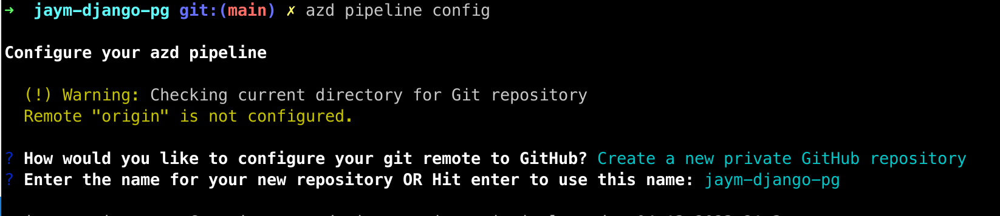

# How fast can you deploy a Django project to Azure?

Using [Azure Container Apps](https://learn.microsoft.com/en-us/azure/container-apps/) and Azure Developer CLI is an incredibly fast way to deploy your Python web application.

Try for yourself and with just a few commands, create a containerized Django application and deploy it to the Azure.

This challenge walks you through deploying a containerized Django Architecture with PostgreSQL, and secured secret management via Key Vault using Azure Developer CLI. 

The first 20 people to complete the challenge will receive a $50 Gift Card to [The GitHub Shop](https://www.thegithubshop.com/).

## Take the challenge

1. Join the [Microsoft Python] Discord server. You will be submitting your answer to the lab there.
2. Run through the modules in our [Azure Django Postgres ACA Lab](https://github.com/Azure-Samples/azure-django-postgres-aca/tree/main/lab/README.md). (Hint: You can use the [fast track](https://github.com/Azure-Samples/azure-django-postgres-aca/tree/main/lab/fasttrack.md) to start from zero and quickly deploy your project). 
3. **BEFORE YOU TEARDOWN**: Complete the [Bonus: Using AZD + GitHub Actions to Manage your Deployment][lab-bonus] section. If you don't have a GitHub repo created please save your project to a repo and ensure that [visibility is set to public](https://docs.github.com/en/repositories/managing-your-repositorys-settings-and-features/managing-repository-settings/setting-repository-visibility).

4. Change the Website in the Repository's _About_ section to the endpoint url for your application.

https://user-images.githubusercontent.com/8632637/232080155-05c8a0cf-69d8-4b7a-92fd-8b413bf1c1b2.mp4

7. Share a link to your GitHub repository in the [**#python-virtual-labs**](https://discord.com/channels/702724176489873509/718335138299248660) channel in the [Microsoft Python] Discord.

## Rules to qualify

In order to get credit for the challenge:

1. Have CREATED AND SUBMITTED your new deployment within the time-frame of the competition. We will start accepting contributions on the 20 April 2023 at 5:00pm MDT (-06:00) and the window will close on the 27 April 2023 Anywhere on Earth.
2. You must successfully deploy a replica of the [Azure Django Postgres ACA Project](https://github.com/azure-samples/azure-django-postgres-aca) to Azure Container Apps USING the azd pipeline config step in the [Bonus: Using AZD + GitHub Actions to Manage your Deployment][lab-bonus] section. The passing pipeline action will be one of the determining factors. The GitHub Action Workflow can be either Manually Triggered or Triggered via Automation.
3. Your GitHub repo must be public. (If you used azd pipeline config and created a private repo, [here are the steps to change the vsibility](https://docs.github.com/en/repositories/managing-your-repositorys-settings-and-features/managing-repository-settings/setting-repository-visibility).
4. Your website must be working to get credit. If you're site is down due to a system error beyond your control, it will be reviewed on a case by case basis.
5. The link for your site must not match any other previously submitted entry.

[lab-bonus]: https://github.com/Azure-Samples/azure-django-postgres-aca/blob/main/lab/bonus-07-use-azd-template.md
[Microsoft Python]: https://aka.ms/python-discord
