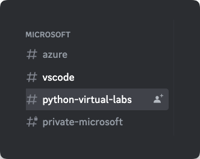

# How Fast Can You Deploy A Django Project to Azure

We're going to show you an incredibly fast way to deploy your django projects to Azure.

The First 20 people to complete the challenge will receive a $50 Gift Card to [The GitHub Shop](https://www.thegithubshop.com/)

## Take the Challenge

1. Join the [Microsoft Python Discord Server](https://aka.ms/python-discord). You will be submitting your answer to the lab there.
2. Visit the python-virtual-labs channel & check the pinned link

    
3. Go to <https://github.com/azure-samples/azure-django-postgres-aca> and run through the modules in [the Lab](https://github.com/Azure-Samples/azure-django-postgres-aca/tree/main/lab). (Hint: You can use the fast track to start from zero and quickly deploy your project). 

4. **BEFORE YOU TEARDOWN**: Complete the [Bonus: Using AZD + GitHub Actions to Manage your Deployment][lab-bonus] section. When prompted, please select create a Private GitHub Repo.

5. [Set the visibility](https://docs.github.com/en/repositories/managing-your-repositorys-settings-and-features/managing-repository-settings/setting-repository-visibility) of the newly created repository to _Public_.
6. Change the Website in the Repository's _About_ section to the endpoint url for your application.

https://user-images.githubusercontent.com/8632637/232080155-05c8a0cf-69d8-4b7a-92fd-8b413bf1c1b2.mp4

7. Share a link to your GitHub repository in the **#python-virtual-labs** channel.

## Rules to Qualify

In order to get credit for the challenge, you must:

1. Successfully Deploy a replica of the [Azure Django Postgres ACA Project](https://github.com/azure-samples/azure-django-postgres-aca) to Azure Container Apps USING the azd pipeline config step in the [Bonus: Using AZD + GitHub Actions to Manage your Deployment][lab-bonus] section. The passing pipeline action will be one of the determining factors. The GitHub Action Workflow can be either Manually Triggered or Triggered via Automation.
2. Have created AND SUBMITTED your new deployment within the time-frame of the competition. We will start accepting contributions on the 20 April 2023 at 5:00pm MDT (-06:00) and the window will close on the 27th Anywhere on Earth.
3. Your website must be working to get credit. If you're site is down due to a system error beyond your control, it will be reviewed on a case by case basis.
4. The link for your site must not match any other previously submitted entry.

[lab-bonus]: https://github.com/Azure-Samples/azure-django-postgres-aca/blob/main/lab/bonus-07-use-azd-template.md
